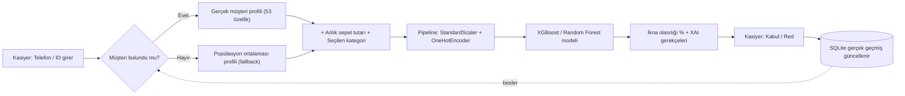

# 🛒 Akıllı Satış Asistanı

Perakende mağazaları için geliştirilmiş, kasa anında **kişiselleştirilmiş çapraz satış** (cross-selling) **önerisi** sunan ve önerinin **nedenini açıklayan** bir makine öğrenmesi tabanlı bir karar destek sistemi demosu. Bu projede veriler ve kategoriler kozmetik sektörüne uyarlandı.

Müşteri kasaya geldiğinde sistem; o müşterinin geçmiş kategori bazlı alışveriş alışkanlıklarına (ne sıklıkla alıyor, normalde ne zaman tükenmesi beklenir) bakarak **"bu müşteriye şu an ek bir ürün önerirsem kabul eder mi?"** sorusunun olasılığını saniyeler içinde hesaplar ve kasiyere somut, açıklamalı bir aksiyon önerisi sunar.

Yapay Zeka ve Veri Bilimi kursu bitirme projesi (Capstone) kapsamında geliştirilmiştir.

---

## 🎯 Proje Neyi Çözüyor?

Perakendede çapraz satış genelde ya herkese aynı kampanyayı gösterecek kadar genel, ya da tamamen kasiyerin inisiyatifine bağlı kalıyor. Bu proje, her müşteri için **veriye dayalı, kişiselleştirilmiş** bir öneri olasılığı üretir.

## 🏗️ Mimari



**Öne çıkan tasarım kararları:**

- Model, eşleşen müşteri yoksa popülasyonun medyan/mod değerleri kullanılır.
- Yeni kayıt olan bir müşteriye sahte geçmiş atanmaz,  kategori bazlı geçmişi boş (NULL) başlar ve yalnızca gerçek kasa işlemleriyle dolar.
- Tüm veritabanı sorguları parametrize edilmiştir.
- **Gerçek Zamanlı Sepet Analizi:** Müşteri ID veya telefon numarası ile anında geçmiş veri sorgulama.
- **XGBoost ile İkna Olasılığı Tahmini:** Müşterinin ek ürünü satın alma potansiyelini skorlama.
- Modelin karar gerekçelerini (sadakat puanı, geçmiş alışveriş döngüsü vb.) kasiyerin anlayacağı dile çevirme.
- Yeni müşteri kaydı ve kabul/red geri bildirimlerinin (feedback loop) anlık olarak sisteme işlenmesi.

## 🛠️ Kullanılan Teknolojiler

| Katman | Teknoloji |
| --- | --- |
| Veri işleme | pandas, numpy |
| Modelleme | scikit-learn (Pipeline, ColumnTransformer, GridSearchCV), XGBoost |
| Arayüz | Streamlit |
| Veritabanı | SQLite |
| Model dağıtımı | joblib |

## Veri Seti ve Model Eğitimi

Projede kullanılan modelin eğitilmesi ve veri setinin hazırlanma aşamaları Google Colab üzerinde gerçekleştirilmiştir.

## 📊 Veri Seti

Veri seti  tamamen rastgele oluşturulmuş yapay bir veri setidir, gerçek kişilerin bilgilerini içermemektedir. 

`musteri_davranis_seti.csv` —> 5.000 müşteri × 53 özellik: demografik bilgiler (yaş grubu, cinsiyet, mağaza tipi vb.), sadakat/promosyon skorları ve 10 ürün kategorisinin her biri için ayrı ayrı "kaç kez aldı", "kaç gün önce aldı", "ortalama alım aralığı", "tüketim oranı" özellikleri. 

- 📓 **Veri Seti Oluşturma ve Veri Analizi Notebook'u:**

https://colab.research.google.com/drive/14ByzmWe18lWSYspynLI9H1d-2kRniNnk?usp=sharing

## 🤖 Model

- **Algoritma:** Random Forest ve XGBoost karşılaştırıldı; `GridSearchCV` ile 5 katlamalı çapraz doğrulama üzerinden hiperparametre optimizasyonu yapıldı (ağaç sayısı, derinlik, öğrenme oranı vb.).
- **Değerlendirme:** Accuracy, Precision, Recall, F1-Score, Confusion Matrix.
- **Seçim kriteri:** Tek metrik yerine Accuracy + F1-Score birlikte gözetildi.
- Çıktı: `smart_kasa_model.pkl` (ColumnTransformer + model tek bir pipeline olarak dışa aktarılmıştır)
- 📓 **Model Eğitim Notebook'u (Colab):**

https://colab.research.google.com/drive/1wzw_u-gNokAhK44nyolnfWJjkIaWgWxx?usp=sharing

- Veri seti (`musteri_davranis_seti.csv`) ve eğitilmiş model (`smart_kasa_model.pkl`) doğrudan bu repoda yer almaktadır.
  
[**PROJEYİ TEST ETMEK İÇİN BURAYA TIKLAYARAK ERİŞEBİLİRSİNİZ**](https://akilli-satis-asistani-jp3xhum9vnluwrt52cepmd.streamlit.app/)

## 💻 Kurulum

*** python 3.9+ bilgisayarınızda kurulu olması gerekir ***

```bash
git clone https://github.com/nesicn/akilli-satis-asistani
cd akilli-satis-asistani

python -m venv venv
source venv/bin/activate        # Windows için: venv\Scripts\activate

pip install -r requirements.txt
```

## ▶️ Çalıştırma

```bash
streamlit run app.py
```

> 💡 Hazır bir müşteriyle denemek için: Repodaki veri setinden telefon numarasını alıp "AI Önerilerini ve Tahmini Hesapla" butonuna basmanız yeterli.


## 🔒

- Proje **hiçbir API anahtarı, token veya gizli kimlik bilgisi kullanmamaktadır** — model, veri ve veritabanı tamamen yerel dosyalar olarak çalışır; harici bir servise bağlanılmaz.
- Veri setindeki müşteri bilgileri sentetik/örnek verilerdir, gerçek kişilere ait değildir. 
- "Ortalama alım aralığı" bir kategoride ancak müşterinin **2. gerçek alışverişinden itibaren** anlamlı hale gelir (ilk alışverişte tanımsızdır, bu kasıtlıdır).
